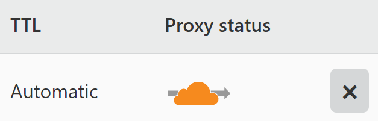
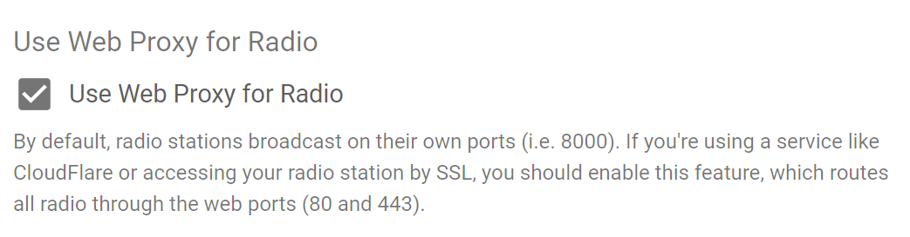

[Cloudflare](https://cloudflare.com/) is a leading provider of reverse proxying and CDN services for the web. Their free tier offers huge benefits in performance and protection that you can take advantage of while using AzuraCast, with a few important caveats. This document details how to use Cloudflare with AzuraCast.

## Enabling Cloudflare with AzuraCast

AzuraCast has full support for using Cloudflare's protection in front of your radio server.

Enabling Cloudflare support from the Cloudflare control panel is as simple as ensuring the little "cloud" next to your radio server's domain (or subdomain) is orange, indicating protection is enabled.

The default settings for Cloudflare will suffice, though you can also switch from "Flexible" to "Full" SSL mode if you like (since AzuraCast itself supports HTTPS). "Strict" SSL mode isn't recommended, as this requires that you maintain an up-to-date SSL certificate on AzuraCast itself (which is possible, but not necessary).

Once you've enabled Cloudflare support for your domain (or radio station's subdomain) from the Cloudflare control panel, you only need to enable one feature inside AzuraCast to enable listeners to connect:

### Enabling the Web Proxy for Radio Broadcasts

One major limitation imposed by Cloudflare is that they do not forward incoming connections to your server that don't come from the traditional web ports (that is, 80 and 443). By default, AzuraCast serves each radio station on its own distinct port in a range from 8000 to 9000. This means your listeners wouldn't normally be able to connect.

Fortunately, we've already built a solution to this problem! In AzuraCast's system administration, on the "System Settings" page, we have a checkbox labeled "Use Web Proxy for Radio". Enable this checkbox and all of the station playback URLs across the system will be updated to automatically use the web port proxy links, which are fully accessible even when Cloudflare protection is enabled.

## Important Notes

### Do Not Cache Radio Content

Cloudflare does not allow you to serve your web radio content via their cached CDN, as the content is a streaming audio file that isn't cacheable via their traditional services. The easiest way to instruct Cloudflare not to cache your radio broadcasts is via their Page Rules feature.

To create a new Page Rule:

1) Visit the Cloudflare control panel, then "Rules", then "Page Rules".
2) Click "Create Page Rule".
3) Enter the URL of your AzuraCast installation, followed by one of the patterns below. The finished pattern should look like `azuracast.example.com/radio/*`
4) Pick the "Cache Level" setting, set it to "Bypass".
5) Click "Save and Deploy Page Rule" at the bottom of the page.

Repeat these steps for all of the following patterns:

 - `/radio/*`
 - `/listen/*`
 - `/hls/*`

### Always Disable Rocket Loader

AzuraCast is **not** compatible with the Rocket Loader optimization offered by Cloudflare. If Rocket Loader is enabled, you will encounter unexpected errors with AzuraCast.

In order to resolve this  error, you must go to your Cloudflare Dashboard and disable the Rocket Launcher settings.

### About Incoming DJ Connections

Because Cloudflare blocks any incoming connections that aren't on the standard web ports, it also blocks the incoming connections that your streamers/DJs would use to broadcast to your station. Unlike the experience we offer listeners through our radio proxy, we can't proxy the incoming broadcast in the same way for technical reasons.

We recommend instructing your streamers/DJs to connect to your server using its IP address rather than its Cloudflare-protected domain name. This will allow them to connect without any issue, and without exposing your origin IP to your regular listener base.

### About AzuraRelay Instances

If you use AzuraRelay instances that should relay a Cloudflare-protected installation, you should use the IP address of the installation as the base URL for the relay (in a format like http://127.0.0.1), rather than the public-facing Cloudflare-protected address. Otherwise, no changes are needed.
