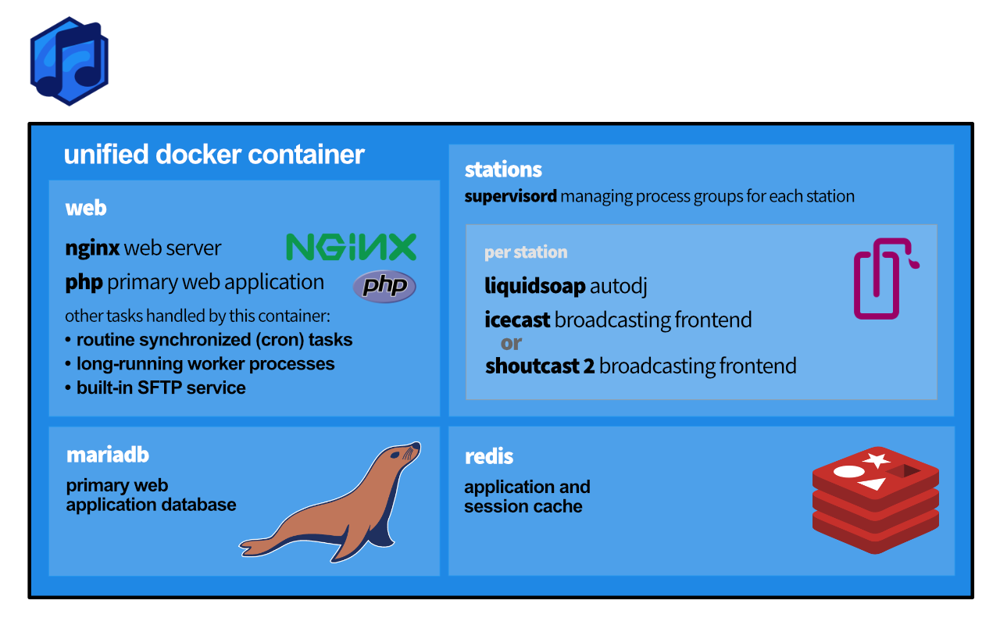

Docker installations come with four files by default:

- `docker.sh`, the Docker Utility Script;
- `.env`, which contains environment variables used by Docker Compose itself;
- `azuracast.env`, which contains customizable environment variables sent to AzuraCast and related services; and
- `docker-compose.yml`, a large file that defines all of the services used by AzuraCast and how they interact.

## Docker Utility Script

If you're using the Docker installation method to run AzuraCast, we have created a helpful utility script to perform common functions without having to type long command names.

### Download the Utility Script

If you've recently followed the [Docker installation instructions](/docs/getting-started/installation/docker), you already have the Docker Utility Script installed. The file is named `docker.sh`.

If you have an older installation, you can use the Docker Utility Script by running these commands inside your AzuraCast directory on your host computer:

```
curl -L https://raw.githubusercontent.com/AzuraCast/AzuraCast/main/docker.sh > docker.sh
chmod a+x docker.sh
```

### Run Command Line Tools

```
./docker.sh cli [command_name]
```

Runs any command exposed by the command line interface tools.

## Available Commands

### Install AzuraCast

```
./docker.sh install
```

Pulls the latest version of all Docker images and sets up the AzuraCast database. When complete, your AzuraCast instance should be up and running.

### Update AzuraCast

```
./docker.sh update-self
./docker.sh update
```

Note: You should always run update-self first to update the updater script.

Automatically pulls down any updated Docker images and applies any database and configuration changes since your last AzuraCast update.

### Uninstall AzuraCast

```
./docker.sh uninstall
```

Turns off and permanently deletes both the AzuraCast Docker containers and permanent volumes that store the AzuraCast database and station media.

:::caution[This command results in data loss!]
This command will fully remove any station media, statistics and metrics, and the entire database associated with your AzuraCast instance.
:::

### Back Up Files and Settings

```
./docker.sh backup [/path/to/backup.tar.gz]
```

Creates a .tar.gz backup copy of the media, statistics and metrics of every station, along with a copy of the full AzuraCast database. You can later restore from this same file in the event of data loss or corruption.

### Restore Files and Settings

```
./docker.sh restore /path/to/backup.tar.gz
```

Extracts a .tar.gz file previously created by this same script's backup command, copying media, statistics and metrics for each station into AzuraCast and importing the version of the database contained in the backup.

:::caution[This command replaces your current installation!]
Restoring from a backup will remove any existing AzuraCast database or media that exists inside the Docker volumes.
:::

@# Customizing Docker Installations

For power users looking to customize or expand their Docker configuration, you should follow these best practices:

- Do not modify or replace the `docker.sh utility script.

- When updating (using the `docker.sh` utility script), it is recommended to run `./docker.sh update-self` before running `./docker.sh update`, to ensure the Docker Utility Script itself is up to date before it updates your Docker installation.

- Environment variables set in `.env` are only used by Docker Compose itself, and aren't passed directly into the AzuraCast containers. You should only modify this file to change the HTTP and HTTPS port mappings used by Nginx (see the "Use Non-Standard Ports" section above).

- The `azuracast.env` file is specific to your environment and can be customized however you like. It will not be replaced during any updates. Once your database has been created, however, changing the password listed in this file will cause the system to fail. If you want to destructively wipe your existing database and other files and set up a new one with the updated password, add the `-v` flag to the end of `docker-compose down to remove all existing volumes, including your database.

- If possible, you should not directly modify `docker-compose.yml`, as some updates may modify how it is defined to resolve bugs or add new features. When updating, you will always be asked if you want to update this file; if you have not modified it, you should always do so.

- Instead of modifying `docker-compose.yml`, you can create a file named `docker-compose.override.yml` with your customizations. The structure of this file is the same as the main `docker-compose.yml` file, and is automatically parsed by Docker Compose to override any definitions in the main file. Updates will not replace this file.

## Modifying Docker

The AzuraCast Docker installation is built to serve the needs of the vast majority of installations out of the box, but there may be times when you need to customize how Docker serves your installation, while still retaining the benefits of compatibility and easy updating that Docker offers.

### The Overall Infrastructure

In recent versions, we have united our Docker infrastructure into a single container that contains the whole application, its databases and caches, and broadcasting controls.



### Docker Compose

In order to make our Docker installation simple to maintain, we rely on a secondary piece of software called [Docker Compose](https://docs.docker.com/compose/). Rather than using lengthy command-line commands, Docker Compose allows you to write simple YAML files to configure the way our Docker containers launch, which ports they forward to the host, mounted disk volumes, etc.

If you follow our installation instructions (or use one of our prebuilt images), your Docker installation is located on your host computer at `/var/azuracast`. Within this folder, you'll see four files by default:

- `docker-compose.yml`, the primary Docker Compose configuration file. AzuraCast's updater automatically prompts you to keep this file updated, which is strongly recommended;

- `docker.sh`, the Docker Utility Script that provides easy aliases for common Docker tasks, such as updating, executing commands inside containers, and more;

- `azuracast.env`, a list of environment (configuration) variables that are sent to the AzuraCast application itself, running inside the web container; and

- `.env`, a separate environment file that affects how Docker Compose _itself_ is configured, and is thus used for higher-level configuration changes like port mappings.

### Overriding Docker Compose

Rather than modifying `docker-compose.yml` directly, it is strongly recommended to instead create a new file called `docker-compose.override.yml` in the same folder. Docker Compose will automatically look for and include this file if it exists, and apply its configuration on top of the base file's instructions.

There are some considerations when creating your own `docker-compose.override.yml`:

- The file must be valid YAML using the standard [Docker Compose format](https://docs.docker.com/compose/compose-file/compose-file-v2/).

- When modifying ports or other lists, you can only add new items, not remove existing ones.

Once you've modified your Docker Compose configuration, you should apply these changes by running:

```sh
docker-compose down
docker-compose up -d
```

Note that this will temporarily shut down your AzuraCast installation and will briefly disconnect your listeners.

### Using Non-standard Ports

:::tip
In newer versions, you no longer need to manually do this; you can instead use the installer by answering "Yes" when prompted to customize settings.
:::

You may want to serve the AzuraCast web application itself on a different port, or host your radio station on a port that isn't within the default range AzuraCast serves (8000-8999).

You can use a helper tool in the Docker Utility Script to easily change the ports used by AzuraCast:

```bash
cd /var/azuracast
./docker.sh update-self
./docker.sh change-ports
```

To override more complex functionality in your Docker installation, see the "Customizing Docker" section below.

# Expanding the Station Port Range

:::tip
Installations running version 0.16.0 or higher can now use our installation script to customizez ports via the terminal which will automatically write the changes into the `docker-compose.yml` file for you. 
:::

For performance reasons, by default Docker installations only open radio ports from port 8000 to 8500. This allows for 50 unique stations to operate.

Depending on your hardware, it may be possible to run more than 50 stations on one AzuraCast instance, but if you want to directly access the additional radio ports, you can follow this simple process.

In the same folder where your Docker installation is (if using recommended instructions, this is `/var/azuracast`), create a new file named `docker-compose.override.yml`.

In this file, paste the following contents:

```yaml
services:
  web:
    ports:
      - "8500-8999:8500-8999"
```

You can modify the port range in this file to meet your needs, such as expanding it to port 8999 instead of 8500.

When creating a new station, AzuraCast will attempt to automatically assign it an available port from the available port range. If you change this port range, you should let AzuraCast know by adding or updating the following values in your `azuracast.env` file:

```
AUTO_ASSIGN_PORT_MIN=8500
AUTO_ASSIGN_PORT_MAX=8999
```

You will need to restart your Docker containers using `docker-compose down`, then `docker-compose up -d` to apply any changes made to these files.

### Mounting a Directory Into a Station

You may want to add music to a station from a directory on your host machine without copying the data into AzuraCast. You can mount the directory into your stations and web container to make them available to AzuraCast by creating a `docker-compose.override.yml`.

In the same folder where your Docker installation is (if using recommended instructions, this is `/var/azuracast`), create a new file named `docker-compose.override.yml`.

In this file, paste the following contents:

```yaml
services:
  web:
    volumes:
      - /path/on/host/computer:/var/azuracast/stations/<STATION_NAME>/media/
```

Replace  the `<STATION_NAME>` with the name of the station directory found under the "Administration" section of the station's profile settings and modify the `/path/on/host/computer` with the path to the directory that you want to mount.

You will need to restart your Docker containers using `docker-compose down`, then `docker-compose up -d` to apply any changes made to this file.

### Storing Your Station Data on the Host Machine

You can store all of you station data in a directory on your host machine. This can be useful if you want to have AzuraCast running on a small SSD and store the station data on a large HDD.

In the same folder where your Docker installation is (if using recommended instructions, this is `/var/azuracast`), create a new file named `docker-compose.override.yml`.

In this file, paste the following contents:

```yaml
services:
  web:
    volumes:
      - /path/on/host/computer:/var/azuracast/stations
```

Modify the `/path/on/host/computer` with the path to the directory that you want to mount.

You will need to restart your Docker containers using `docker-compose down`, then `docker-compose up -d` to apply any changes made to this file.

# Custom Default Track

:::tip
In newer versions of AzuraCast, you no longer need to upload a custom default track this way; you can upload a unique "Custom Fallback Track" per-station using the web interface.
:::

When nothing is playing on your station you'll hear the default error.mp3 file of AzuraCast playing. You can replace this file by mounting your own .mp3 file via a `docker-compose.override.yml`.

In the same folder where your Docker installation is (if using recommended instructions, this is `/var/azuracast`), create a new file named `docker-compose.override.yml`.

You can place your .mp3 file anywhere on your host machine. You just have to specify the path to it by replacing this part: `/path/to/your/file.mp3`

We recommend to put that file inside the `/var/azuracast` directory though so that you have everything in the same place. Make sure that the format of the file specified matches the streaming format exactly.

In this file, paste the following contents:

```yaml
services:
    web:
        volumes:
            - /path/to/your/file.mp3:/usr/local/share/icecast/web/error.mp3
```

You will need to restart your Docker containers using `docker-compose down`, then `docker-compose up -d` to apply any changes made to this file.

### Stream Intro File

:::tip
In newer versions of AzuraCast, you can now directly upload an intro track on the Mount Point edit page.
:::

You can add a music file to play when someone initially connects to your stream. Remember when creating intro files that they **must match the exact same format, bitrate and sample rate as your mount point to work properly.**

First, tell the Docker filesystem where to find your intro file. Inside the AzuraCast directory on your host (by default, `/var/azuracast`), create a file named `docker-compose.override.yml` with the following contents:

```yaml
services:
    stations:
        volumes:
            - /path/to/your/file.mp3:/usr/local/share/icecast/web/intro.mp3
```

Now restart AzuraCast via `docker-compose down && docker-compose up -d`.

Return to the AzuraCast web interface, visit the "Mount Points" page for your station, edit the mount point you want to add an intro for, and inside the "Advanced: Custom Frontend Configuration" field, enter this, based on the last portion of the mounted file from the above example:

```
<intro>/intro.mp3</intro>
```

For more information, see the [IceCast documentation.](https://www.icecast.org/docs/)

### Custom Favicon

:::tip
In newer versions of AzuraCast, you can manage this via the web UI.
:::

To override the favicon and other browser icons used by AzuraCast, you should follow these steps:

1. - Upload your icon to favicon-generator.org. Be sure to leave "Generate icons for Web, Android, Microsoft, and iOS (iPhone and iPad) Apps" checked.
1. - Once your icon set is downloaded, it will be in a .zip file format; extract that file and copy it to the host server where AzuraCast is hosted.
1. - Inside the AzuraCast directory on your host (by default, /var/azuracast), create a file named docker-compose.override.yml with the following contents:
```services:
    web:
        volumes:
            - /path/to/your/favicon/folder:/var/azuracast/www/static/icons/production
```
Restart AzuraCast via `docker-compose down && docker-compose up -d`.

### Increase PHP Allowed Memory

When you encounter an error like the following one you will need to increase the amount of memory that PHP is allowed to use:

```
AzuraCast.CRITICAL: Fatal error: Allowed memory size of 268435456 bytes exhausted (tried to allocate 212992 bytes) ...
```

You can easily do this by editing the `azuracast.env` located in `/var/azuracast/`.

There you can find the following entry:

```
# PHP's maximum memory limit.
# PHP_MEMORY_LIMIT=128M
```

Change this to look like this:

```
# PHP's maximum memory limit.
PHP_MEMORY_LIMIT=512M
```

You should increase the value until the error dissappears.

The `M` after the value stands for `Megabytes`.

Refer to the following page for more information about the allowed values for this setting: https://www.php.net/manual/docs/faq.using.php#faq.using.shorthandbytes

After you have changed this setting you need to restart AzuraCast via `docker-compose down && docker-compose up -d`.

### Adding custom NGINX configurations

If you need to add some custom configurations to NGINX you can do this by your `custom.conf` file into the `web` container via the `docker-compose.override.yml` like this:

```yaml
services:
  web:
    volumes:
      - ./custom.conf:/etc/nginx/azuracast.conf.d/custom.conf
```

All config files placed in the `/etc/nginx/azuracast.conf.d/` are automatically included in the main AzuraCast NGINX configuration.

### Multi-Site Installation

AzuraCast can exist on a server with other web sites hosted at different URLs. Check out our [Multi-Site Docker Installation guide](/docs/administration/docker/multi-site-installation) for more information.
