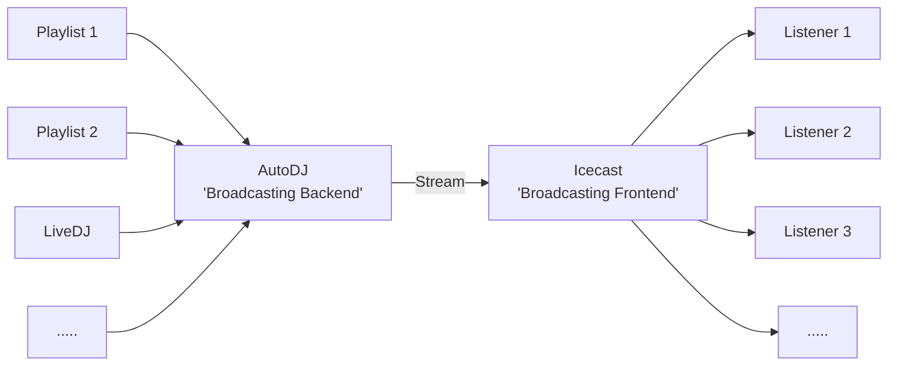

:::tip[Required Permissions]
To view a station's administration section, users must be in a role that has the "View Station Page" permission for the specified station.
:::

Each "Station" in AzuraCast is a separate entity with its own media, playlists, DJs, mount points, remote relays and statistics.

You can create any number of stations in a single AzuraCast installation, limited only by the total resources available on the server; for example, by default, only the ports for the first 50 stations are exposed.

Each station has a main "Profile" page that offers an overview of that station's currently playing status, the status of its AutoDJ and main broadcasting software, and a list of all of its available mount points and remote relays.

If a user has the appropriate permissions, they will also see additional management options along the left sidebar of the Station Management page.

## AutoDJ (Backend) vs Broadcasting Software (Frontend)

Every station has two essential components that are always running and which generate a broadcasted signal for the station:

- The **AutoDJ** (also occasionally known as the "Broadcasting Backend") is a piece of software (in AzuraCast's case, Liquidsoap) that compiles media from various sources, different playlists and live input, and assembles that input into a single composited output stream, which it then transcodes into any number of various formats. Listeners don't connect directly to the AutoDJ to listen to the station, as it is optimized for producing the broadcast rather than serving it to a larger audience.

- The **Broadcasting Software** (or the "Broadcasting Frontend") is the lightweight piece of software (either Icecast or SHOUTcast) whose primary job is to take the signal created by the AutoDJ and broadcast it out to potentially hundreds or thousands of listeners. This software is specifically optimized to support very many concurrent incoming connections with very little impact on system performance.



Part of AzuraCast's function is to ensure both of these processes are properly configured, automatically started and kept running behind the scenes. When running an AzuraCast installation, you don't have to directly start either of these services for any station, and (with the exception of some specific changes, which require a brief restart) don't need to modify them directly for configuration changes in AzuraCast to take effect.

### SHOUTcast

#### Adding a License Key

- Visit the `Station Profile`
- Click `Edit Profile`
- Switch to the `Broadcasting` tab
- Put the following in the `Custom Configuration` section:

```json
{ "licenceid": "YOUR_LICENSE_ID", "userid": "YOUR_USER_ID" }
```
