:::caution
If you are using a reverse proxy service (like CloudFlare) in front of your installation, be aware that these services often prevent direct connections to the ports that broadcasters connect to. You should instruct your streamers to use the direct IP address of your server instead.
:::

## Mixxx

**Linux, MacOS, Windows; Free and Open-Source**

[Mixxx](https://www.mixxx.org) is free and open-source DJ software that also supports live broadcasting via Icecast and Shoutcast servers.

Live broadcasting settings can be found in the preferences menu (`Options` -> `Preferences`). It is recommended to use "Icecast 2" mode when broadcasting to AzuraCast. Out of the box, Mixxx does not include the LAME MP3 encoder (for licensing reasons), but it is not needed when connecting to AzuraCast; just set your broadcast format to 'Ogg Vorbis' and LiquidSoap will transcode the broadcast into the correct output format.

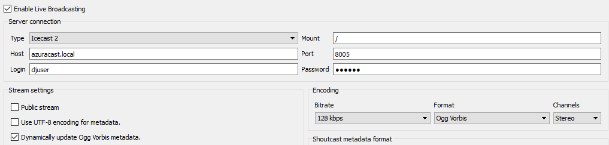

## Broadcast Using This Tool (BUTT)

**Linux, MacOS, Windows; Free and Open-Source**

[BUTT](https://danielnoethen.de/butt/) is cross-platform and available for free. While BUTT supports both Icecast and Shoutcast connection modes, since AzuraCast internally uses Liquidsoap to facilitate all DJ connections, the connection mode used is largely irrelevant. Thus, **we recommend using Icecast mode** as it is more modern.

To add a new server, click "Settings" on the main app panel, then in the "Server Settings" section, click the "ADD" button to create a new server.

Using the "Connection Information" from your station's "Streamers/DJ Accounts" page, enter:

 - In "Type", select "Icecast".
 - In "Address", enter the value from the "Server" heading on the info page.
 - In "Port", enter the value from the "Port" heading on the info page.
 - In "Icecast user", enter your DJ username.
 - In "Password", enter your DJ password.
 - In "Icecast mountpoint", enter the value from the "Mount Name" heading on the info page; this is likely "/" (without quotes).

## Broadcast Using This Tool Modernized (BUTTM)

**MacOS, Windows; Proprietary, Commercial**

[BUTTM](https://buttm.app/) is the spiritual successor to BUTT, but with a modernized user interface and experience. It's available for a one-time fee. Either edition is compatible with AzuraCast, but the Standard edition is limited to broadcasting at a bitrate of 128kbps.

Just like BUTT, BUTTM supports both Icecast and Shoutcast connection modes. Since AzuraCast internally uses Liquidsoap to facilitate all DJ connections, the connection mode used is largely irrelevant; thus, **we recommend using Icecast mode** as it is more modern.

To add a new server, click "Server Manager" on the main app panel, then click the "+" button in the bottom left corner to add a new server.

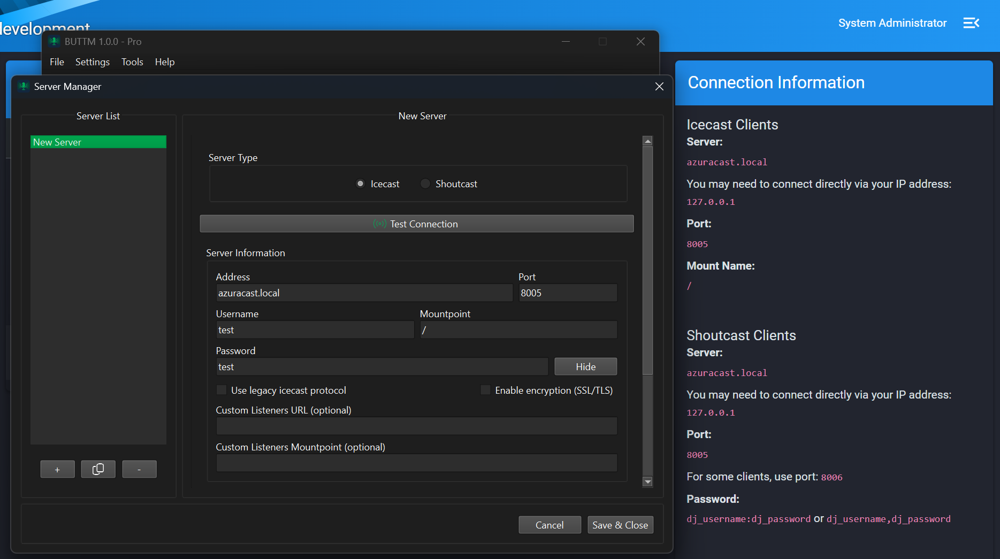

Using the "Connection Information" from your station's "Streamers/DJ Accounts" page, enter:

 - In "Type", select "Icecast".
 - In "Address", enter the value from the "Server" heading on the info page.
 - In "Port", enter the value from the "Port" heading on the info page.
 - In "Username", enter your DJ username.
 - In "Mountpoint", enter the value from the "Mount Name" heading on the info page; this is likely "/" (without quotes).
 - In "Password", enter your DJ password.

## SAM Cast

**Windows; Proprietary, Commercial**

[SAM Cast](https://spacial.com/sam-cast/) is commercial software sold by Spacial. It is compatible with AzuraCast by using the MP3 encoder and the "Icecast 2" server connection settings.

From the main SAM Cast window, click "Encoders" at the bottom left.

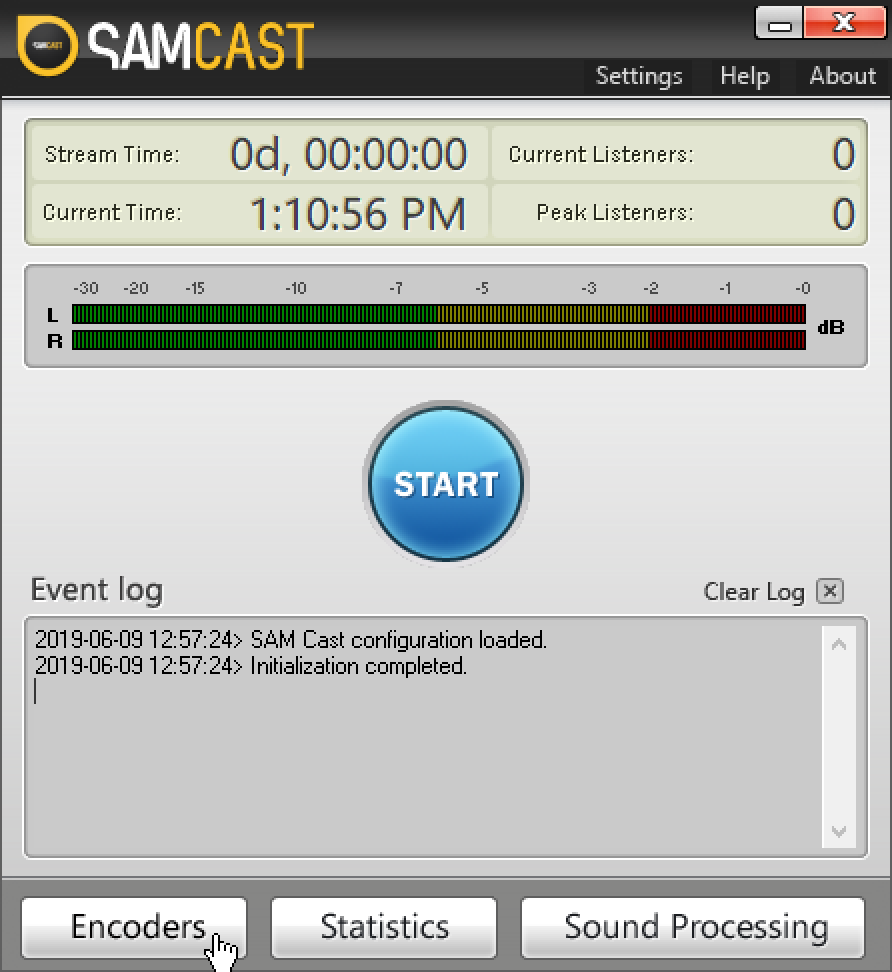

In the Encoders window that pops up, click the plus sign button on the toolbar to add a new encoder.

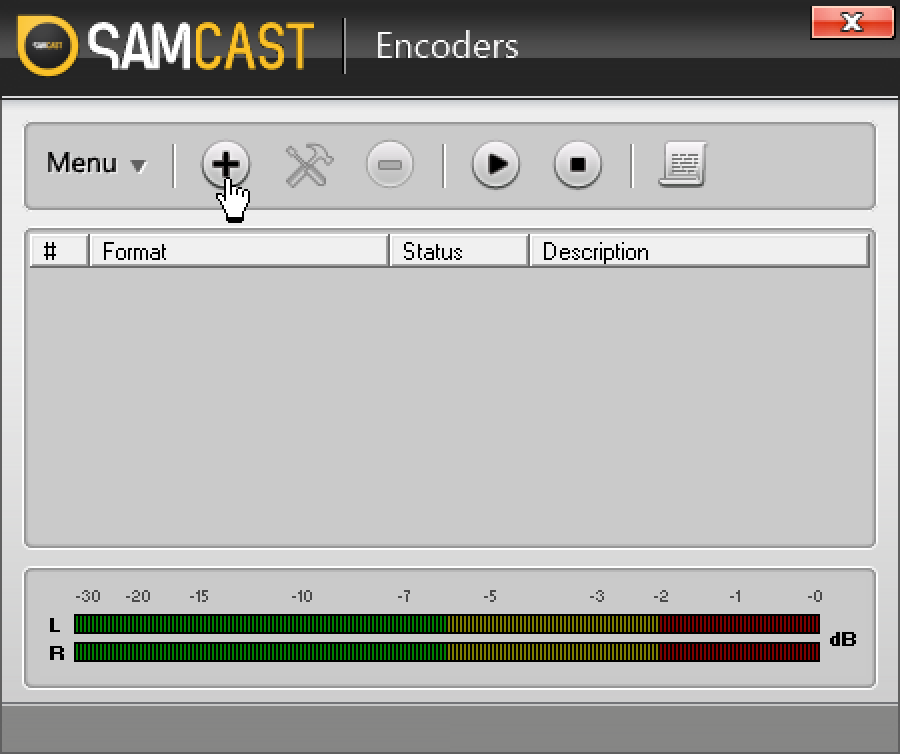

You will be asked to select an encoder. It is recommended to select `MP3 (LAME_ENC)`, because this allows for the easiest constant bit rate (CBR) streaming, which causes the fewest issues when broadcasting.

Click "OK" at the bottom to continue to encoder details.

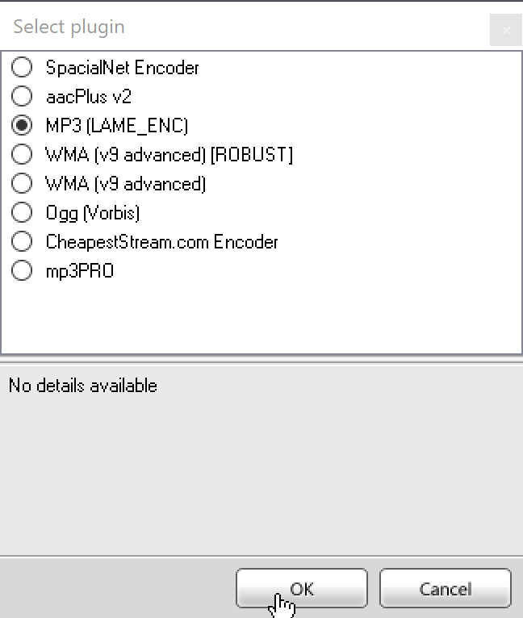

On the first tab of the encoder details, change your bitrate from the default 64kbps to your desired bitrate. This should likely match the highest bitrate that you broadcast out to your listeners. By default, it should at least be 128kbps.

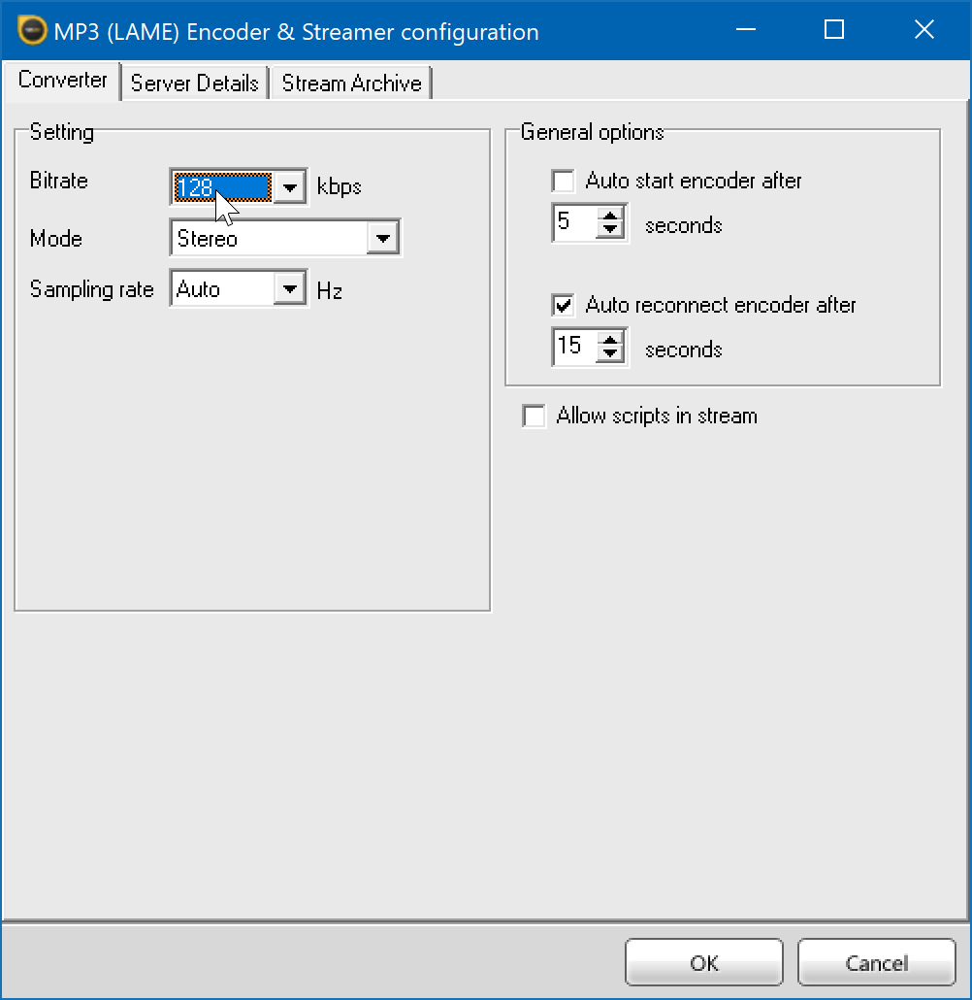

Click the "Server Details" tab. On the "Server Type" selector, choose "Icecast", then choose "Icecast 2" in the secondary selector.

You can now populate the "Server Details" section with the connection information supplied to you via AzuraCast's "Streamers/DJs" page. You will want to use the connection information for "Icecast Clients", the first section on the page.

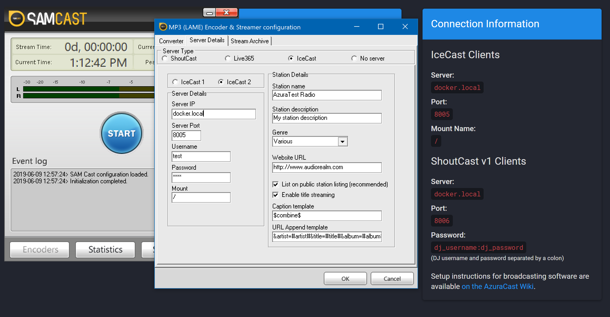

Click OK to return to the main Encoders pane, where you will now see a new encoder with "Idle" status.

Select the encoder, then click the play-button icon in the toolbar to begin broadcasting.

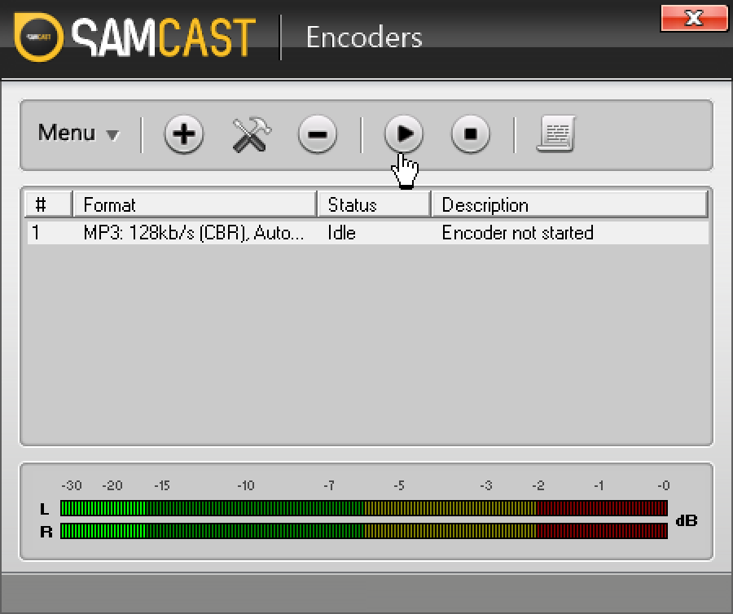

## RadioBOSS

**Windows; Proprietary, Commercial**

[RadioBOSS](https://www.djsoft.net/) is a commercial software sold by IP Kuzmitski D.V. at DJSoft.net.

Streaming via both Icecast mode and Shoutcast mode are available; however, because AzuraCast uses Liquidsoap as an intermediary for DJ connections, **it is recommended to use Icecast for connections, as it is more modern**.

The Live broadcasting feature is possible in their Standard and Advanced edition (not in the Express edition).

Note that for ease of use we use the `Configuration Wizard`, you can also enter all connection details manually.

1. In the top menu bar, select `Settings` -> `Options`

2. In the `Settings` window, select `Broadcast` on the left

3. To add a new encoder, click the `+` button

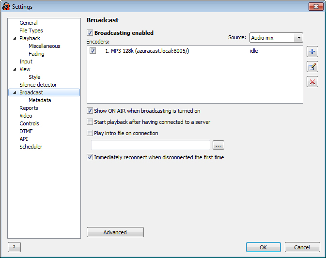

4. The Encoder-window will open, next click the button called `Configuration Wizard`.

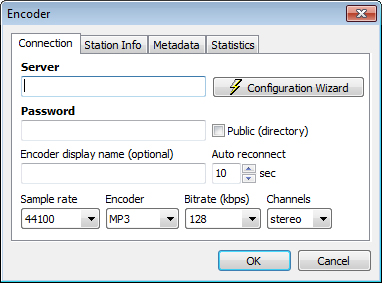

5. Select `Icecast 1 & 2` and click `Next >`

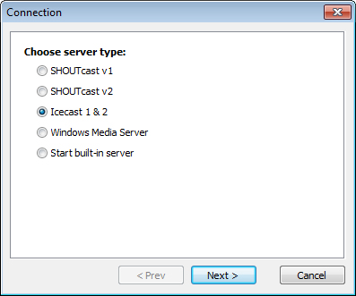

6. Take over the corresponding credentials you can find in Azuracast:

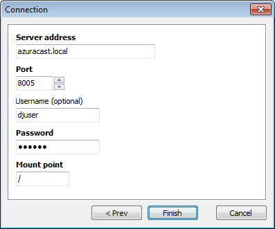

7. Click `Finish`

8. Finish by changing the rest of the settings by preference:
  - Connection
  - Sample Rate
  - Encoder
  - Bitrate
  - Channels
  - Station info

  If needed, here you can override the info that can be found in the main `Settings` (From step 1), under `Broadcasting` -> `Metadata`

9. Then finally click `OK` to save the Encoder.

10. In the Settings window, check the checkboxes for all encoders that you want to use.
   Remember to turn on the option `Broadcasting enabled` on top.

On succesful connection, the log report in the bottom-left corner of RadioBOSS will show the following message: "Connected to server! (Output N)". This means that listeners can now connect to the streaming server (either Icecast or Shoutcast).

If the logs show "[E40] Cannot start broadcast" in red, go over the above steps.

More information can be found in the RadioBOSS Help System. Press `Ctrl+F1` inside the RadioBOSS application, or in the top menu bar go to `Help` -> `Contents`.

The following articles in there are helpful:

- `Operation` -> `Broadcasting Internet radio`
- `Options` -> `Broadcast`
- `Options` -> `Broadcast` -> `Metadata`

## PlayIt Live

**Windows; Proprietary, Free**

[PlayIt Live](https://www.playitsoftware.com/Products/Live) is a free live-assist and automated radio playout system from PlayIt Software.

It allows streaming via **Icecast**, **Shoutcast v1** and **Shoutcast v2** via a plugin, that you can download for free [here](https://www.playitsoftware.com/Plugins/View/InternetBroadcast), after creating an account on their website. This plugin also allows you to record the stream, in MP3.

The installation steps for the plugin are relatively simple, so they're not covered in this guide.

***Note:** This software is only capable of streaming via MP3, due to plugin limitations.*

PlayItLive supports both Icecast and Shoutcast connection modes; however, because AzuraCast uses Liquidsoap as an intermediary for all DJ connections, the connection method is not important. Thus, **it is recommended to use the Icecast connection mode, as it is more modern**.

1. After installing the Internet Broadcast plugin, select the menu **Plugins** menu, on the top menu bar and select the **Plugin Manager...** option.

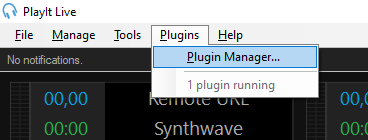

_Select the Plugins menu, then the Plugin Manager option_

2. A new window should appear, and within it the Internet Broadcast plugin.

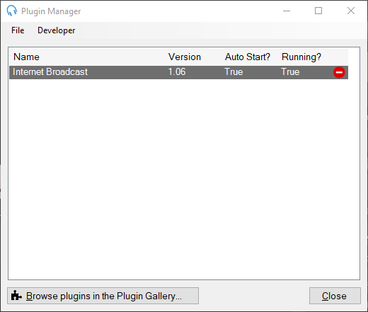
_The Plugin Manager window_

3. Open the plugin settings, by double clicking on it's name. This window should appear.

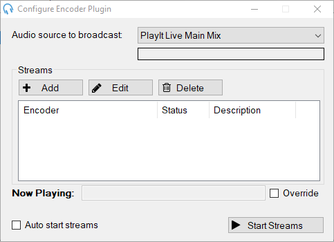
_Plugin Settings_

**There are a few settings that you can customize here:**

- In **Audio source to broadcast** you can define which input is going to be transmited to the server;
- **Auto start streams** let's you start streaming after opening the software.

**4.** Under **Streams**, click **Add** to add a new streaming server.

**1.** Using the connection details, available in your AzuraCast instance, under the **Streamers/DJ Accounts** page,

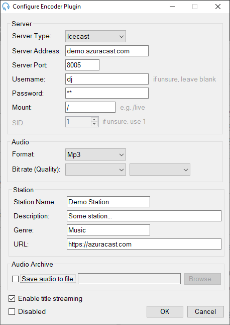

_Connection Information for Icecast_

... fill this form in the PlayIt Live software.

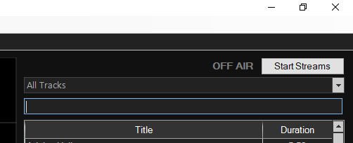

_Using the details above to fill the form_

**Don't forget to change these details with yours, this is just an example!**

**Notes:**

- The **Save audio to file** field can be left unchecked. Check it if you want to record the stream into a MP3 file.
- Under **Audio**, select the audio bitrate and the format (stereo or mono) that matches your station.

**2.** After filling the form fields, click **OK** to save the server details.

**3.** To start broadcasting, click on Start Streams here on in the main interface of the software.

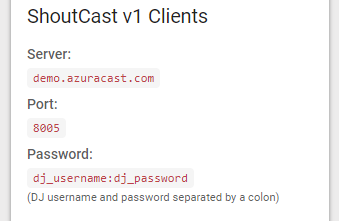

If the server is configured correctly, the **OFF AIR** text will change to **ON AIR**. If not, re-check your configuration.

## Rocket Broadcaster

**Windows; Proprietary (Free & Pro editions)**

Rocket Broadcaster is a robust streaming encoder for Windows, designed for internet radio stations and professional broadcasting. It captures audio from various sources, including microphones, line-in devices, and other applications, and streams it to your station. Rocket Broadcaster supports both Icecast and Shoutcast servers.

1. **Configure Your Audio Input**

    - Go to **Options** > **Preferences**.
    - In the **Audio Input** tab, select your microphone or audio interface as the **Input device**. Set the **Sample rate**, typically to `44100 Hz`.
    - If you plan to broadcast audio from other applications, configure **System Audio Capture** in the same preferences window.
    - Click **OK**.
    - Return to the main window and ensure the **VU meters** move when audio is present.

2. **Configure Your Stream**

    - Go to **Broadcast** > **Streams....**
    - Click **Add** to create a new output stream.
    - Enter the connection details provided by your streaming server (Icecast or Shoutcast). This includes:
      - **Server Type:** Select `Icecast 2` or the appropriate `SHOUTcast` version.
      - **Hostname or IP**
      - **Port**
      - **Mountpoint** (for Icecast)
      - **Username** and **Password** (or `dj_username:dj_password` for some SHOUTcast v1 setups).
    - Under **Encoder Settings**, choose your desired **Codec** (e.g., MP3, Ogg Vorbis, AAC for Pro) and set the **Bitrate** and **Channels**.
    - Click **OK**.

3. **Test Your Stream**

    - In the main Rocket Broadcaster window, click **Start Broadcast**.
    - If successful, you'll see "On Air". If you encounter an error, double-check your stream settings for typos.

4. **Configure Metadata (Optional)**
    - To display song artist and title to your listeners, go to **Broadcast** > **Metadata Capture**.
    - Configure the capture method to automatically pull metadata from your radio automation system or media player.

See the official [Rocket Broadcaster documentation](https://www.rocketbroadcaster.com/docs/) for detailed instructions on how to set up and use the software.
